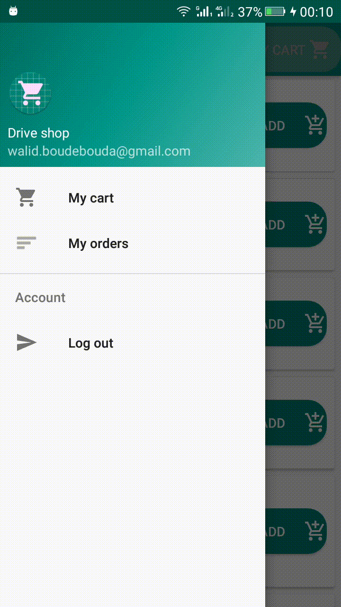
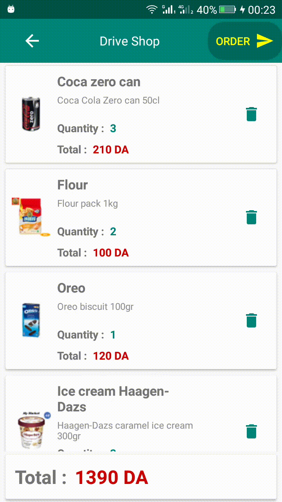

# Drive-shop-android

This Android application was developped as a part of my final year Masters project at the institute of electrical and electronic engineering in Algeria. This application is for ordering products from a supermarket, and following the status of the orders in real time.

After login, the first activity is the products activity where the user scrolls the products list and adds them to his cart.

Once products are selected, the user clicks on "My cart" button to check the content of his cart, edit it, or confirm his order. Finally My Orders activity shows the current state of the order.

A java server have been developped for receiving the orders, and communicating with an ESP32 based robot for collecting the products on the shelves.
